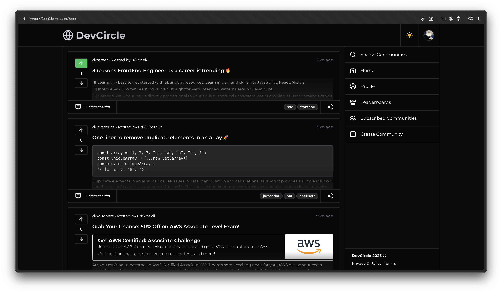

```bash
  ____              ____ _          _
 |  _ \  _____   __/ ___(_)_ __ ___| | ___
 | | | |/ _ \ \ / / |   | | '__/ __| |/ _ \
 | |_| |  __/\ V /| |___| | | | (__| |  __/
 |____/ \___| \_/  \____|_|_|  \___|_|\___|
```

This is an open-source community platform built with the latest features of Next.js 13.



> **Warning**
> This project is still in development and is not ready for production use.
>
> It uses new technologies (Server Actions, Prisma ORM) which are subject to change and may break your application.

## Tech Stack

- [`Next.js`](https://nextjs.org/): A popular React framework for building server-rendered and static websites.
- [`React`](https://react.dev/): A JavaScript library for building user interfaces.
- [`TypeScript`](https://www.typescriptlang.org/): A statically-typed superset of JavaScript that enhances developer productivity and code maintainability.
- [`TailwindCSS`](https://tailwindcss.com/): A highly customizable CSS framework that allows for rapid UI development with utility classes.
- [`Shadcn/UI`](https://ui.shadcn.com/): Re-usable components built using Radix UI and Tailwind CSS.
- [`Prisma`](https://www.prisma.io/): A modern database toolkit for TypeScript and Node.js that simplifies database access and management.
- [`Uploadthing`](https://uploadthing.com/) (S3) - File Uploads For Next.js Developers
- [`NextAuth.js`](https://next-auth.js.org/): A complete authentication solution for Next.js applications.
- [`Editor.js`](https://editorjs.io/): A block-style editor for creating rich content with a clean and extensible API.
- [`React Query`](https://tanstack.com/query/latest): A data fetching and caching library for React applications.
- [`Prettier`](https://prettier.io/): A code formatter that helps maintain consistent code style.
- [`TypeScript-ESLint`](https://typescript-eslint.io/): A pluggable and configurable linter tool for identifying and reporting code errors and enforcing code style.

## Installation

### 1. Clone the repository

```bash
git clone https://github.com/BharathxD/DevCircle
```

### 2. Install dependencies

```bash
pnpm install
```

### 3. Create a `.env` file

Create a `.env` file in the root directory and add the environment variables as shown in the `.env.example` file.

### 4. Run the application

```bash
pnpm dev
```

### 5. Push database

```bash
npx prisma generate
```

## License

Licensed under the MIT License. Check the [LICENSE](./LICENSE) file for details.

## Contributing

Contributions are welcome! Please open an issue if you have any questions or suggestions. Your contributions will be acknowledged.

See the [contributing guide](./CONTRIBUTING.md) for more information.
